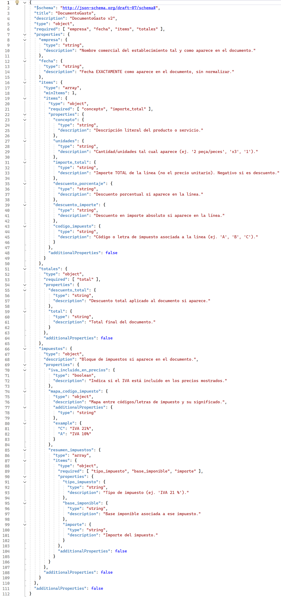
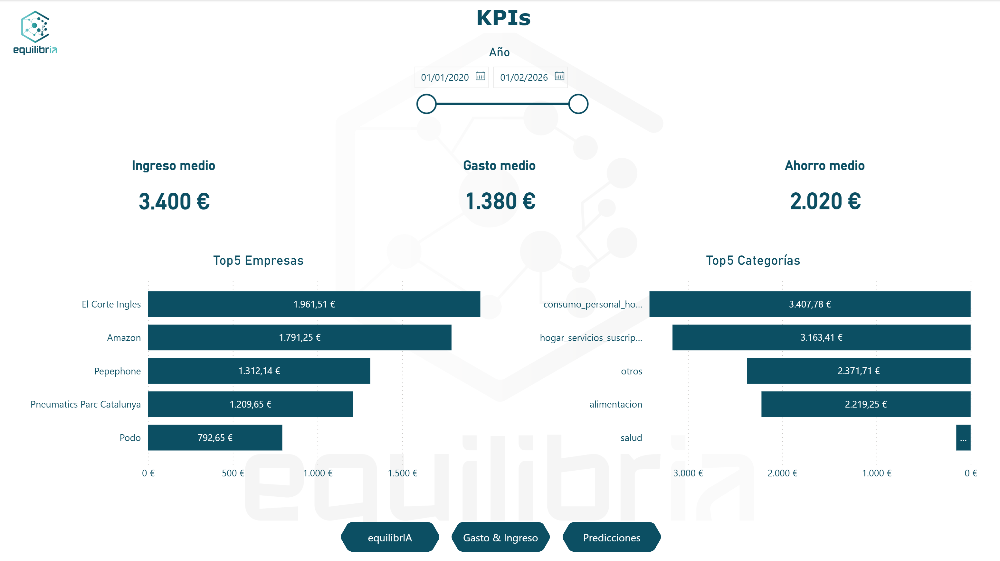
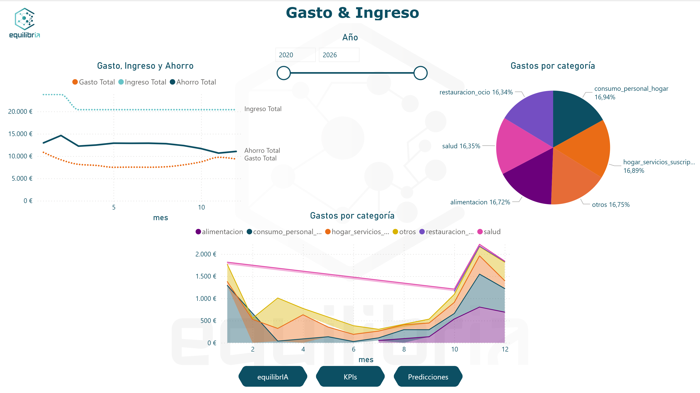
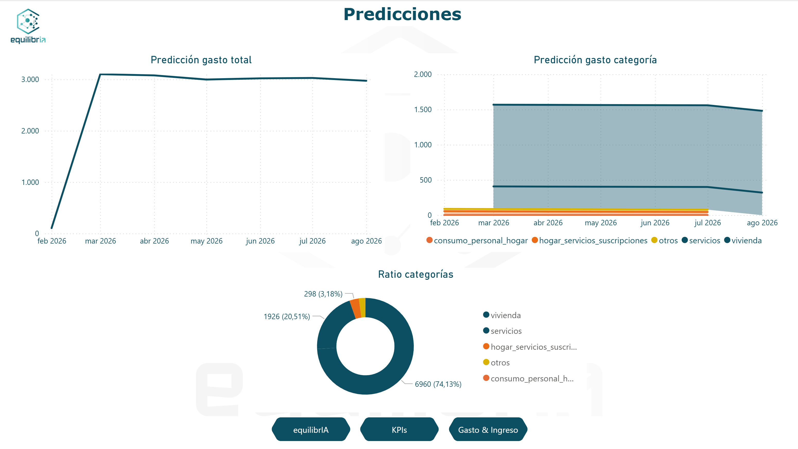
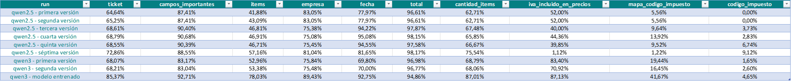
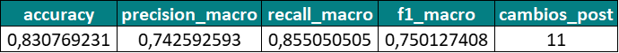
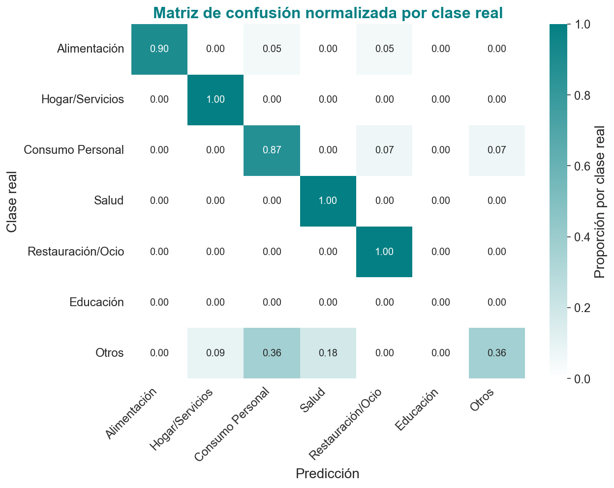
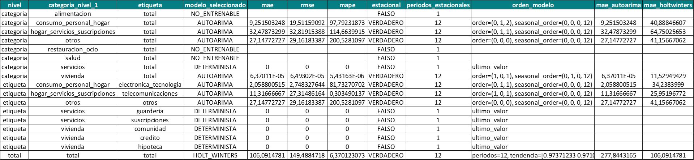

# AI Financial Intelligence Platform

End-to-end AI pipeline for extracting, validating, classifying, storing and forecasting personal financial expenses from receipts and invoices.

This project was developed as the final Master's thesis for the **Master in Data Science, Big Data & Artificial Intelligence** at Universidad Complutense de Madrid / NTIC Master.

The system combines:

- vision-language models,
- LoRA fine-tuning,
- NLP classification,
- relational databases,
- human-in-the-loop validation,
- time-series forecasting,
- Streamlit UI,
- and Power BI analytics.

The objective is to transform unstructured financial documents into clean, auditable and analyzable data.

---

## Overview

The platform processes receipts and invoices and transforms them into structured financial information.

The pipeline covers the full lifecycle:

1. File ingestion
2. Image preprocessing
3. Structured extraction with a fine-tuned Qwen VL model
4. JSON schema validation
5. Financial normalization
6. Human-in-the-loop review
7. Accounting validation
8. Expense classification with XLM-RoBERTa
9. MySQL persistence
10. Analytical materialization
11. Time-series forecasting
12. Power BI-ready consumption tables

---

## Main Features

- Receipt and invoice ingestion from user-uploaded files
- Image normalization and preprocessing
- Vision-language extraction using Qwen VL
- LoRA adapter for financial document extraction
- Structured JSON output validated against a custom schema
- Human review loop with Streamlit
- Accounting consistency checks
- Expense classification using XLM-RoBERTa
- Deterministic sub-labeling rules
- MySQL database with audit and consumption layers
- Forecasting with AutoARIMA / Holt-Winters comparison
- Future expense predictions persisted in MySQL
- Runtime configuration through `.env`
- Models hosted externally on Hugging Face
- Power BI dashboard connected to the MySQL consumption layer
- No private receipts, invoices or personal financial data included in the repository

---

## Architecture

```text
User document
    ↓
Ingestion
    ↓
Preprocessing
    ↓
Qwen VL + LoRA extraction
    ↓
JSON schema validation
    ↓
Normalization
    ↓
Human-in-the-loop review
    ↓
Accounting validation
    ↓
XLM-RoBERTa classification
    ↓
MySQL persistence
    ↓
Consumption tables
    ↓
Forecasting
    ↓
Power BI / analytics
```

---

## Repository Structure

```text
.
├── apps/
│   ├── streamlit_app.py
│   └── logo/
│
├── bd/
│   ├── bootstrap_bd.py
│   ├── conexion.py
│   ├── publicar_y_materializar.py
│   └── sql/
│       ├── 001_esquema.sql
│       └── 002_rutinas_y_eventos.sql
│
├── datos/
│   └── JSON schema v2.json
│
├── docs/
│   └── images/
│       ├── classifier_confusion_matrix.png
│       ├── dashboard_gasto_ingreso.png
│       ├── dashboard_kpi.png
│       ├── dashboard_portada.png
│       ├── dashboard_predicciones.png
│       ├── forecast_summary_table.png
│       ├── json_schema.png
│       ├── metricas_clasificacion.png
│       └── qwen_evaluation_table.png
│
├── pipeline/
│   ├── pipeline.py
│   └── modulos/
│       ├── modulo_ingesta.py
│       ├── modulo_preprocesado.py
│       ├── modulo_extraccion_qwen.py
│       ├── motor_qwen_transformers.py
│       ├── modulo_normalizacion.py
│       ├── validacion_contable.py
│       ├── modulo_clasificacion.py
│       └── modulo_predicciones.py
│
├── scripts/
│   └── reglas_subetiquetas.py
│
├── utilidades/
│   ├── configuracion.py
│   └── puente_ui.py
│
├── .env.example
├── .gitignore
├── requirements.txt
└── README.md
```

Runtime folders such as `inputs/`, `outputs/`, logs, temporary files and local models are ignored by Git.

---

## AI Models

The repository does not include heavy model files. Models are hosted externally on Hugging Face.

### 1. Qwen VL Financial Extraction LoRA

- Base model: `Qwen/Qwen3-VL-4B-Instruct`
- LoRA adapter: `Showker87/qwen3-vl-financial-extraction-lora`
- Task: structured extraction from receipts and invoices
- Output: JSON document following the project schema

Model repository:

```text
https://huggingface.co/Showker87/qwen3-vl-financial-extraction-lora
```

### 2. XLM-RoBERTa Financial Classifier

- Base model: `xlm-roberta-base`
- Fine-tuned model: `Showker87/xlmr-financial-classifier`
- Task: macro-category classification of normalized financial documents

Supported macro categories:

```text
alimentacion
hogar_servicios_suscripciones
consumo_personal_hogar
salud
restauracion_ocio
educacion
otros
```

Model repository:

```text
https://huggingface.co/Showker87/xlmr-financial-classifier
```

---

## Technology Stack

- Python
- PyTorch
- Transformers
- PEFT / LoRA
- Qwen VL
- XLM-RoBERTa
- Pandas
- MySQL
- Streamlit
- pmdarima
- statsmodels
- Power BI
- Hugging Face Hub

---

## Requirements

Recommended environment:

- Python 3.10+
- MySQL Server
- CUDA-compatible GPU strongly recommended for Qwen VL inference
- Hugging Face access for model download

Install dependencies:

```bash
python -m pip install -r requirements.txt
```

---

## Configuration

Create your local `.env` file from `.env.example`:

```bash
cp .env.example .env
```

On Windows PowerShell:

```powershell
Copy-Item .env.example .env
```

Then edit the MySQL credentials if needed.

Example configuration:

```env
APP_NAME=AI_Financial_Intelligence_Platform
APP_ENV=development

LOG_LEVEL=INFO

MYSQL_HOST=localhost
MYSQL_PORT=3306
MYSQL_DATABASE=contabilidad_familiar
MYSQL_USER=root
MYSQL_PASSWORD=root

INPUT_DIR=inputs
OUTPUT_DIR=outputs

QWEN_MODEL_ID=Qwen/Qwen3-VL-4B-Instruct
QWEN_ADAPTER_ID=Showker87/qwen3-vl-financial-extraction-lora
QWEN_STRICT_LOCAL=false

CLASIFICADOR_MODEL_ID=Showker87/xlmr-financial-classifier
CLASIFICADOR_DEVICE=cuda

PUENTE_UI_DIR=outputs/puente_ui
```

The `.env` file is ignored by Git and should never be committed.

---

## Database Initialization

Initialize the MySQL database, tables, routines and events:

```bash
python -m bd.bootstrap_bd
```

Expected output:

```text
Bootstrap completado: base de datos, tablas, rutinas y eventos aplicados correctamente
```

The internal database name remains `contabilidad_familiar` for compatibility with the existing SQL schema.

---

## Running the Pipeline

Run the main orchestrator:

```bash
python -m pipeline.pipeline
```

The pipeline will:

1. initialize the database if needed,
2. launch the Streamlit UI,
3. load the Qwen VL model and LoRA adapter,
4. load the XLM-RoBERTa classifier,
5. wait for user documents,
6. process, validate, classify and persist the results,
7. update materialized analytical tables,
8. generate and persist future forecasts.

---

## Runtime Notes

Processing one receipt or invoice may take approximately **10–15 minutes**, depending on:

- GPU availability,
- image size and quality,
- model cache state,
- and whether the Hugging Face models need to be downloaded for the first time.

The first execution may take longer because the Qwen base model, the LoRA adapter and the XLM-RoBERTa classifier must be downloaded and loaded into memory.

This is **not a real-time application**. It is designed as a local end-to-end AI pipeline focused on traceability, validation, persistence and analytical consumption.

---

## JSON Schema

The extraction output is validated against a custom JSON schema before entering the normalization and persistence layers.



---

## Streamlit UI

The Streamlit interface is launched automatically by the orchestrator.

It is used for:

- uploading receipts and invoices,
- reviewing extracted information,
- correcting normalized fields,
- accepting or saving manual changes,
- supporting the human-in-the-loop validation process.

---

## Power BI Dashboard

The project includes a Power BI dashboard connected to the MySQL consumption layer.

The dashboard provides:

- general financial overview,
- income and expense analysis,
- KPI monitoring,
- category and subcategory segmentation,
- historical spending trends,
- and forecast visualization.

The `.pbix` file is not included in the repository because it may contain private financial data, local connection settings or cached data.








---

## Model Evaluation

### 1. Extraction Model — Qwen VL + LoRA

The extraction module is based on **Qwen3-VL-4B-Instruct** fine-tuned with a **LoRA adapter** for financial document extraction.

The following table shows the evaluation runs performed during the extraction model development. The last row corresponds to the final trained Qwen3-VL LoRA model used in this project.



The final trained model achieved the following evaluation results:

| Metric | Result |
|---|---:|
| Ticket-level success | 85.37% |
| Important fields | 92.71% |
| Items | 78.03% |
| Company | 89.43% |
| Date | 92.75% |
| Total | 94.86% |
| Item count | 87.01% |
| VAT included in prices | 87.13% |
| Tax-code map | 41.67% |
| Tax code | 4.65% |

#### Interpretation

The model performs well on the most important business fields:

- company,
- date,
- total amount,
- item count,
- and document-level extraction.

Performance is weaker on tax-specific structured fields such as:

- `mapa_codigo_impuesto`,
- `codigo_impuesto`.

This is expected because those fields are sparse, inconsistently represented across documents and highly dependent on the receipt or invoice format.

---

### 2. Classification Model — XLM-RoBERTa

The expense classification module is based on **XLM-RoBERTa** fine-tuned for macro-category prediction.

Validation metrics:

| Metric | Value |
|---|---:|
| Accuracy | 0.830769 |
| Macro Precision | 0.742592 |
| Macro Recall | 0.855050 |
| Macro F1 | 0.750127 |

The following image summarizes the classifier validation metrics:



The following normalized confusion matrix shows the classifier behavior across the validation set:



The model performs strongly in well-defined categories such as `Hogar/Servicios`, `Salud`, `Restauración/Ocio`, `Alimentación` and `Consumo Personal`.

The `Otros` category shows more dispersion, which is expected because it acts as a heterogeneous fallback class for expenses that do not clearly belong to a more specific category.

The classifier is combined with deterministic sub-labeling rules to improve the final interpretability of the expense categories.

---

### 3. Forecasting Models — AutoARIMA and Holt-Winters

The forecasting module compares different approaches for future expense prediction:

- AutoARIMA
- Holt-Winters
- deterministic fallback rules for sparse or non-trainable series

This component should be interpreted primarily as an **architectural and methodological module**, not yet as a production-grade forecasting solution.

#### Current Limitation

The available historical dataset is concentrated in a relatively short time window. This limits the quality of statistical forecasting models because AutoARIMA and Holt-Winters require sufficient temporal depth and regularity to capture meaningful patterns.

As a result, forecasting performance is constrained mainly by the available data history, not only by model choice.

Even so, the module already implements:

- time-series aggregation,
- train/test comparison,
- model selection,
- deterministic fallback strategies,
- future horizon generation,
- and persistence of forecasts in MySQL for downstream BI consumption.

#### Current Observations

In the current dataset:

- Holt-Winters performs better than AutoARIMA for the total aggregated series.
- At category level, AutoARIMA is frequently selected when enough structure is available.
- Sparse or non-trainable series are handled with deterministic fallback strategies.
- Forecasts are persisted in MySQL and can be consumed directly from Power BI.

Example pipeline summary:

| Item | Result |
|---|---:|
| Trained categories | 5 |
| Skipped categories | 3 |
| Trained labels | 7 |
| Skipped labels | 25 |
| Future predictions generated | 78 |

The following table summarizes the selected forecasting models and error metrics by category and label:



---

## Documentation Assets

This repository includes anonymized documentation screenshots under:

```text
docs/images/
```

These images document:

- Qwen extraction evaluation,
- classifier validation metrics,
- classifier confusion matrix,
- forecasting summary,
- JSON schema,
- and Power BI dashboards.

No real receipts, invoices or raw personal financial documents are included.

---

## Data Privacy

This repository does not include:

- personal receipts,
- invoices,
- private images,
- raw financial data,
- local `.env` files,
- runtime outputs,
- cached models,
- local model checkpoints,
- Power BI files containing private data.

Only source code, schema definitions, configuration templates and documentation assets are included.

---

## Limitations

- Processing one document can take approximately 10–15 minutes depending on hardware and model cache state.
- Qwen VL inference requires significant GPU memory.
- The extraction model may produce incorrect or incomplete JSON on low-quality images.
- Human validation is still required before final persistence.
- Forecasting quality is limited by the short time span of the available historical data.
- The project is currently designed for local execution.
- Docker deployment is not yet included.
- SQLAlchemy integration for Pandas database access is a future improvement.
- The internal MySQL database name remains `contabilidad_familiar` for compatibility with the existing SQL schema.

---

## Future Work

Potential improvements:

- Dockerized setup
- SQLAlchemy integration
- FastAPI serving layer
- Automated tests
- CI pipeline
- Synthetic public demo dataset
- Public demo Power BI file using synthetic data
- Improved model evaluation reports
- Better GPU/memory configuration options
- Deployment-ready configuration
- Expanded forecasting evaluation with longer historical data

---

## Academic Context

This project was developed as a Master's thesis focused on applying artificial intelligence to real-world financial document processing.

It integrates:

- computer vision,
- multimodal LLMs,
- NLP classification,
- relational modeling,
- data validation,
- auditability,
- forecasting,
- business intelligence preparation.

---

## Author

**Aitor Guijarro Castro**

Mechanical / automotive R&D engineer transitioning into AI engineering and data systems.

GitHub:

```text
https://github.com/AitorG87
```

Hugging Face:

```text
https://huggingface.co/Showker87
```